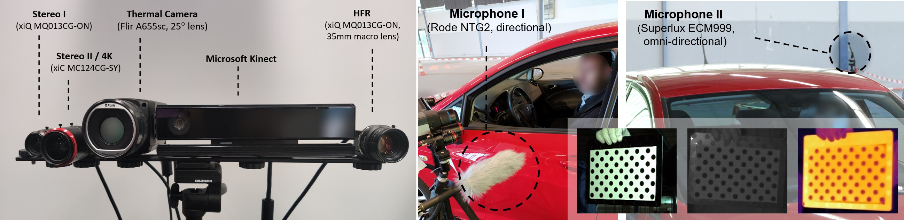
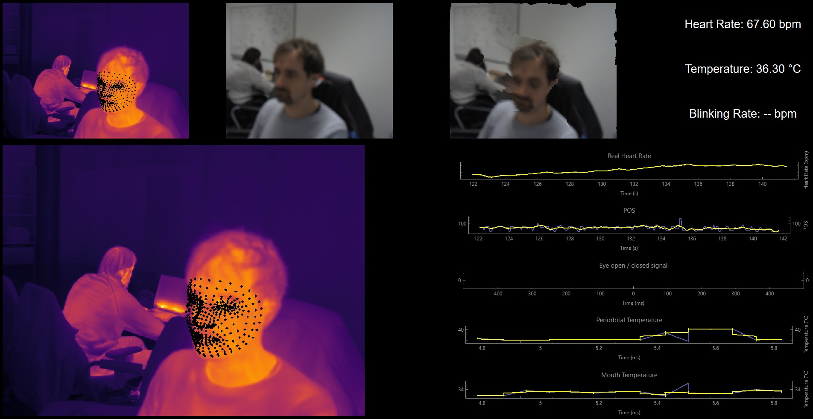

# QT Camera Systems




## Downloads

Clone the repository via
```
$ git clone ssh://git@erlgit.htwsaar.de:2222/snnu/computer-vision/qt_camera_systems.git
```

## Requirements

- **Python 3.8+**  
- **Spinnaker 4.0 SDK** and **Spinnaker 3.8 Python bindings** (for FLIR/PointGrey Thermal Cameras)  
- **XIMEA API** (for XIMEA industrial cameras)  
- **neurovc**
This library contains utility functions, in particular for motion magnification (`MagnificationTask`, `AlphaLooper`, ...) and calibration / video IO helpers.

## Contents of this Repository

The project website for the original setup used to develop the calibration can be found [here](https://www.snnu.uni-saarland.de/covid19/). We use a 4x13 circular calibration board with 1.5cm circle diameter which is printed and glued 
onto a metal plate with the same pattern cutout.

- **Calibration and alignment** for multiple cameras (visible, NIR, thermal).  
  - Scripts and classes that handle capturing frames from Ximea and FLIR/PointGrey thermal cameras, performing stereo alignment, and merging landmarks (in `MultiModalMappingWorker`, etc.).  
- **Motion magnification** with a Lagrangian approach, referencing the `neurovc.momag.flow_processing` module.  
- **Threaded architecture** leveraging `PyQt6`:
  - `FrameGrabber`, `ThermalGrabber` classes for camera capture in dedicated QThreads.
  - Separate QThreads for data I/O, calibration, motion magnification, and real-time face or skin segmentation.  
- **Heart rate / rPPG** extraction logic (`HeartRateWorker`) employing a “POS” approach.  
- **Thermal data** mapping and region-of-interest temperature measurement (e.g., eye, mouth).  
- **Calibration pattern**: See `calibration_pattern.pdf` for the 4×13 circular board layout.  
- **GUI Applications**:
  - `VIScreener` for multimodal display of multiple cameras (thermal, NIR, etc.).
  - `Momag` for motion magnification demonstrations.
  - `MomagWebcam` for motion magnification with a webcam.

## Installation

1. **Set up a Conda environment**:
- Install [Miniconda](https://docs.conda.io/en/latest/miniconda.html) if you haven’t already, and create a new environment with Python 3.8:
  ```
  conda create -n multimodal python=3.8 -y conda activate multimodal
  ```

2. **Install dependencies**:
- Install requirements via:
  ```
  pip install -r requirements.txt
  ```

3. **Install `Spinnaker` SDK and Python bindings**:
- Install the `Spinnaker SDK` from the resources folder in the repository:
  - [Spinnaker SDK Installer](resources/SpinnakerSDK_FULL_4.0.0.116_x64.exe)
- Install the Python bindings 
  - (windows):
    ```
    pip install .\resources\windows\spinnaker_python-4.0.0.116-cp38-cp38-win_amd64\spinnaker_python-4.0.0.116-cp38-cp38-win_amd64.whl
    ```
  - (mac):
    ```
    untar -xvf .\resources\mac\spinnaker_python-4.1.0.172-cp38-cp38-macosx_13_0_arm64.tar.gz
    pip install .\resources\mac\spinnaker_python-4.1.0.172-cp38-cp38-macosx_13_0_arm64\spinnaker_python-4.1.0.172-cp38-cp38-macosx_13_0_arm64.whl
    ```
  - (linux): Almost the same as mac.

4. **Install `XIMEA` API**:
- Install the `XIMEA API` from the repository:
  - [XIMEA API Installer](resources/XIMEA_APIInstaller.exe)
- After installation, manually copy the `ximea` Python bindings to the appropriate site-packages directory of the Python environment. The bindings are typically located in:
  ```
  C:\Program Files\XIMEA\API\python\ximea
  ```
- Copy the `ximea` python folder to your Conda environment:
  ```
  <conda-env-path>\Lib\site-packages\
  ```

## Run the applications

To run the VIScreen_demo, connect one FLIR camera and one XiC ximea camera to your computer and run
```
python -m multicamera_systems.apps.VIScreen_demo
```
or 
```
python -m multicamera_systems.apps.VIScreen_webcam
```
for the webcam only version. The app can be controlled with the arrow keys to turn landmarks on and off and switch the video view. 

Space and numbers 1-5 control the motion magnification output.




## Citation

This software is built on original routines developed during my PhD research
at Saarland University. While I occasionally used institutional resources
(e.g., equipment for testing), the core logic and concepts are my own work.
Any proprietary or confidential materials from any university, company, or
third party included here are to the best of my knowledge clearly marked as such.
Copyright (c) 2025, Philipp Flotho.

If you use this code in work for publications, please cite in the following way.

**1. Camera routines**:
  
  > Flotho, P., Bhamborae, M., Grun, T., Trenado, C., Thinnes, D., Limbach, D., & Strauss, D. J. (2021). Multimodal Data Acquisition at SARS-CoV-2 Drive Through Screening Centers: Setup Description and Experiences in Saarland, Germany. J Biophotonics.
  
  BibTeX entry
  ```bibtex
  @article{flotea2021b,
      author = {Flotho, P. and Bhamborae, M.J. and Grün, T. and Trenado, C. and Thinnes, D. and Limbach, D. and Strauss, D. J.},
      title = {Multimodal Data Acquisition at SARS-CoV-2 Drive Through Screening Centers: Setup Description and Experiences in Saarland, Germany},
      year = {2021},
    journal = {J Biophotonics},
    pages = {e202000512},
    doi = {https://doi.org/10.1002/jbio.202000512}
  }
  ```

**2. Motion magnification**:

  > Flotho, P., Heiß, C., Steidl, G., & Strauss, D. J. (2022, July). Lagrangian motion magnification with landmark-prior and sparse PCA for facial microexpressions and micromovements. In 2022 44th Annual International Conference of the IEEE Engineering in Medicine & Biology Society (EMBC) (pp. 2215-2218). IEEE.
  
  ```bibtex
  @inproceedings{flotho2022lagrangian,
    title={Lagrangian motion magnification with landmark-prior and sparse PCA for facial microexpressions and micromovements},
    author={Flotho, Philipp and Hei{\ss}, Cosmas and Steidl, Gabriele and Strauss, Daniel J},
    booktitle={2022 44th Annual International Conference of the IEEE Engineering in Medicine \& Biology Society (EMBC)},
    pages={2215--2218},
    year={2022},
    organization={IEEE}
  }
  ```

and

  > Flotho, P., Heiss, C., Steidl, G., & Strauss, D. J. (2023). Lagrangian motion magnification with double sparse optical flow decomposition. Frontiers in Applied Mathematics and Statistics, 9, 1164491.
  
  ```bibtex
  @article{flotho2023lagrangian,
    title={Lagrangian motion magnification with double sparse optical flow decomposition},
    author={Flotho, Philipp and Heiss, Cosmas and Steidl, Gabriele and Strauss, Daniel J},
    journal={Frontiers in Applied Mathematics and Statistics},
    volume={9},
    pages={1164491},
    year={2023},
    publisher={Frontiers Media SA}
  }
  ```

**3. Thermal landmarks:**

  > Flotho, P., Piening, M., Kukleva, A., & Steidl, G. (2024). T-FAKE: Synthesizing Thermal Images for Facial Landmarking. arXiv preprint arXiv:2408.15127.
  
  ```bibtex
  @article{flotho2024t,
    title={T-FAKE: Synthesizing Thermal Images for Facial Landmarking},
    author={Flotho, Philipp and Piening, Moritz and Kukleva, Anna and Steidl, Gabriele},
    journal={arXiv preprint arXiv:2408.15127},
    year={2024}
  }
  ```

## License

The landmarking models that the landmarking code downloads and which are required for thermal landmarking are licensed under the [Attribution-NonCommercial-ShareAlike 4.0 International](LICENSE.txt) license as the models are provided as "Results" from the [FaceSynthetics dataset](https://github.com/microsoft/FaceSynthetics).

This Software may incorporate or reference code examples, libraries, or other materials from third parties (e.g., FLIR). Any such third-party materials are subject to their own license terms, which you must comply with in addition to this license. In the event of any direct conflict between this license and a third-party license, the third-party license terms shall prevail for that portion of the Software.

This code has been shared for internal use at SNNU, htw saar and EmRoLab. 
If you have received a copy, please adhere to the following license terms.

0. **Internal Scope and Permission Grant**
   - You may use, copy, and modify this Work for academic, educational, or research 
     purposes strictly within SNNU, htw saar and EmRoLab. 
   - Distribution outside of these institutions or any commercial usage 
     requires a separate, written permission from the Authors.
1. **Retention of Notices and Indication of Changes**
   - You must retain the above copyright notice and this license in all copies
     or substantial portions of the Work.
   - If you make any modifications (including translations or format-shifting),
     you must clearly indicate in any copies or substantial portions of the
     Work that changes were made, and include a brief description of those changes.

2. **Attribution**
   - You must give **appropriate credit** to the original author(s), provide a
     link to the source (e.g., https://github.com/phflot), and indicate that the Work
     is licensed under this "Academic Attribution" license.
   - Appropriate credit, at a minimum, includes the name of the original author,
     the title of the Work (if provided), and a link to this
     license or repository.

3. **Academic Citation**
   - If you (the licensee) publish or publicly present any result, demonstration,
     or other output (including websites, demos, or research papers) that directly
     uses or builds upon this Work, you must explicitly credit the Author, and cite
   - the relevant publication(s) listed in this README or documentation.
   - The credit must be reasonably visible and state, for example:
     > “Portions of this work use or adapt software created by [...].”
   - Additionally, if a specific publication is requested (see README),
     please cite it in your bibliography.

4. **No Additional Restrictions**
   - You may not apply legal terms or technological measures that legally
     restrict others from doing anything the license permits.

5. **No Endorsement**
   - Nothing in this license constitutes or may be interpreted as permission
     to assert or imply that the Author endorses you or your use of the Work.

6. **Disclaimer of Warranty**
   - THE WORK IS PROVIDED “AS IS,” WITHOUT WARRANTY OF ANY KIND, EXPRESS OR
     IMPLIED, INCLUDING BUT NOT LIMITED TO THE WARRANTIES OF MERCHANTABILITY,
     FITNESS FOR A PARTICULAR PURPOSE AND NONINFRINGEMENT. IN NO EVENT SHALL
     THE AUTHOR(S) OR COPYRIGHT HOLDER(S) BE LIABLE FOR ANY CLAIM, DAMAGES,
     OR OTHER LIABILITY, WHETHER IN AN ACTION OF CONTRACT, TORT, OR OTHERWISE,
     ARISING FROM, OUT OF, OR IN CONNECTION WITH THE WORK OR THE USE OR OTHER
     DEALINGS IN THE WORK.

7. **License Reference**
   - A copy of this "Academic Attribution" license text must be included with
     all distributions of the Work or any substantial portion thereof. If the
     full text is not included in a file named `LICENSE`, you must include a
     reference to the original license location (e.g., a URL to this README).